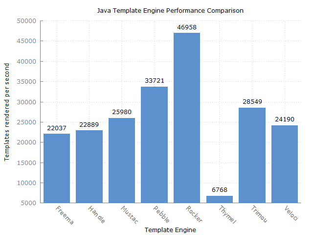

template-benchmark
================

JMH benchmark for the the most popular Java template engines.

1. Download the source code and build it (`mvn clean install`)
2. Run the benchmark suite with `java -jar target/benchmarks.jar`

Rules of Template Engine Configuration
======================================
It is imperative that each template engine is configured in way to reflect real-world usage as opposed to it's *optimal* configuration. Typically this means an out-of-the-box configuration.

To strive for a common set of features across template engines, the following configurations are expected:
* Disabling of HTML escaping
* Template loaded from classpath prior to actual benchmark

Interpreting the Results
========================
The benchmarks measure throughput, given in "ops/time". The time unit used is seconds. 
Generally, the score represents the number of templates rendered per second; the higher the score, the better.

Example Output
===============
The following benchmark was run on a machine with the following stats:

* OS: CentOS 7
* Kernel: 3.10.0-123.el7.x86_64
* Memory: 8GB
* Processor: Intel(R) Core(TM) i5-3470 CPU @ 3.20GHz

````
# JMH 1.6.1 (released 4 days ago)
# VM invoker: /usr/java/jdk1.7.0_67/jre/bin/java
# VM options: <none>
# Warmup: 5 iterations, 1 s each
# Measurement: 10 iterations, 1 s each
# Timeout: 10 min per iteration
# Threads: 1 thread, will synchronize iterations
# Benchmark mode: Throughput, ops/time

(...)
# Run complete. Total time: 00:06:23

Benchmark                       Mode  Cnt      Score     Error  Units
FreemarkerBenchmark.benchmark  thrpt   50  14886.563 ± 128.597  ops/s
MoustacheBenchmark.benchmark   thrpt   50  32821.125 ± 284.831  ops/s
PebbleBenchmark.benchmark      thrpt   50  26547.355 ± 311.757  ops/s
ThymeleafBenchmark.benchmark   thrpt   50    756.536 ±  16.601  ops/s
VelocityBenchmark.benchmark    thrpt   50  18388.098 ±  59.178  ops/s
````


